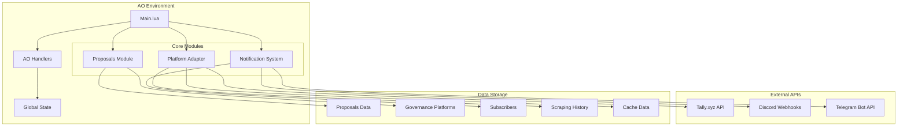
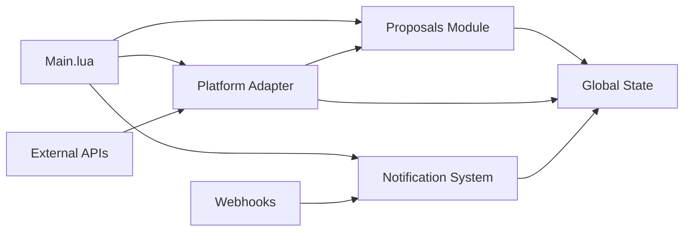
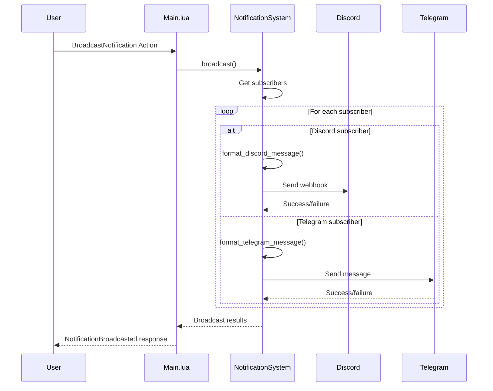

# Genie-Proposal-Summarizer: Technical Documentation

## Table of Contents
1. [Project Overview](#project-overview)
2. [Architecture Overview](#architecture-overview)
3. [System Architecture](#system-architecture)
4. [Module Architecture](#module-architecture)
5. [Data Flow Diagrams](#data-flow-diagrams)
6. [API Integration](#api-integration)
7. [State Management](#state-management)
8. [AO Handler System](#ao-handler-system)
9. [Deployment & Configuration](#deployment--configuration)
10. [Usage Examples](#usage-examples)
11. [Error Handling](#error-handling)
12. [Performance Considerations](#performance-considerations)

---

## Project Overview

**Genie-Proposal-Summarizer** is a decentralized governance data management system built on the Arweave Operating System (AO). The system provides comprehensive functionality for scraping, managing, and notifying about governance proposals from various DAO platforms.

### Key Features
- **Governance Data Scraping**: Automated data collection from Tally.xyz API
- **Proposal Management**: Complete CRUD operations for governance proposals
- **Notification System**: Discord and Telegram integration
- **State Management**: Comprehensive tracking and caching
- **Balance Management**: Token-based proposal creation system
- **Rate Limiting**: Intelligent API call management
- **Error Handling**: Robust error tracking and recovery

---

## Architecture Overview

```
┌─────────────────────────────────────────────────────────────────┐
│                    Genie-Proposal-Summarizer                    │
│                         AO Agent                                │
├─────────────────────────────────────────────────────────────────┤
│                                                                 │
│  ┌─────────────────┐    ┌─────────────────┐    ┌──────────────┐ │
│  │   Main.lua      │    │  AO Handlers    │    │ Global State │ │
│  │  (Entry Point)  │◄──►│  (25 Actions)   │◄──►│  Management  │ │
│  └─────────────────┘    └─────────────────┘    └──────────────┘ │
│           │                       │                       │     │
│           ▼                       ▼                       ▼     │
│  ┌─────────────────────────────────────────────────────────────┐ │
│  │                    Core Modules                             │ │
│  │  ┌──────────────┐  ┌──────────────┐  ┌──────────────────┐   │ │
│  │  │ Proposals    │  │ Platform     │  │ Notification     │   │ │
│  │  │ Management   │  │ Adapter      │  │ System           │   │ │
│  │  └──────────────┘  └──────────────┘  └──────────────────┘   │ │
│  └─────────────────────────────────────────────────────────────┘ │
│                                                                 │
├─────────────────────────────────────────────────────────────────┤
│                    External Integrations                        │
│  ┌──────────────┐  ┌──────────────┐  ┌────────────────────────┐ │
│  │ Tally.xyz    │  │ Discord      │  │ Telegram Bot API       │ │
│  │ API          │  │ Webhooks     │  │                        │ │
│  └──────────────┘  └──────────────┘  └────────────────────────┘ │
└─────────────────────────────────────────────────────────────────┘
```

---

## System Architecture

### High-Level System Components



### Module Dependencies



---

## Module Architecture

### 1. Main.lua (Entry Point)

**Purpose**: Central orchestrator and AO handler registration

**Key Components**:
- AO Handler registration (25 actions)
- Global state initialization
- Module coordination
- JSON library management

**Architecture**:
```
┌─────────────────────────────────────────────────────────────┐
│                        Main.lua                             │
├─────────────────────────────────────────────────────────────┤
│  ┌─────────────────┐  ┌─────────────────┐  ┌──────────────┐ │
│  │ Module Imports  │  │ Global State    │  │ AO Handlers  │ │
│  │                 │  │ Initialization  │  │ Registration │ │
│  └─────────────────┘  └─────────────────┘  └──────────────┘ │
│           │                       │                       │ │
│           ▼                       ▼                       ▼ │
│  ┌─────────────────────────────────────────────────────────┐ │
│  │              Handler Functions                          │ │
│  │  • Info Handler                                         │ │
│  │  • Governance Handlers                                  │ │
│  │  • Proposal Handlers                                    │ │
│  │  • Notification Handlers                                │ │
│  │  • State Management Handlers                            │ │
│  │  • Balance Management Handlers                          │ │
│  └─────────────────────────────────────────────────────────┘ │
└─────────────────────────────────────────────────────────────┘
```

### 2. Proposals Module

**Purpose**: Comprehensive proposal and governance platform management

**Key Features**:
- Enhanced proposal data structures
- Governance platform management
- Organization and token management
- Advanced search and filtering

**Data Structures**:
```lua
-- Enhanced Proposal Structure
{
    id = "string",
    title = "string",
    description = "string",
    content = "string",
    proposer = "string",
    platform = "string",
    governance_platform_id = "string",
    status = "active|pending|passed|failed|executed|canceled|expired",
    type = "proposal",
    url = "string",
    deadline = timestamp,
    created_at = timestamp,
    updated_at = timestamp,
    executed_at = timestamp,
    canceled_at = timestamp,
    
    -- Voting data
    for_votes = number,
    against_votes = number,
    abstain_votes = number,
    quorum = number,
    total_votes = number,
    
    -- Execution data
    execution_time = timestamp,
    timelock_id = "string",
    
    -- Metadata
    metadata = table,
    actions = table,
    tags = table,
    category = "string"
}
```

**Architecture**:
```
┌─────────────────────────────────────────────────────────────┐
│                    Proposals Module                         │
├─────────────────────────────────────────────────────────────┤
│  ┌─────────────────┐  ┌─────────────────┐  ┌──────────────┐ │
│  │ Data Structures │  │ CRUD Operations │  │ Search &     │ │
│  │                 │  │                 │  │ Filter       │ │
│  └─────────────────┘  └─────────────────┘  └──────────────┘ │
│           │                       │                       │ │
│           ▼                       ▼                       ▼ │
│  ┌─────────────────────────────────────────────────────────┐ │
│  │              Core Functions                             │ │
│  │  • add_proposal()                                      │ │
│  │  • get_proposal()                                      │ │
│  │  • update_proposal()                                   │ │
│  │  • delete_proposal()                                   │ │
│  │  • search_proposals()                                  │ │
│  │  • sort_proposals()                                    │ │
│  │  • execute_proposal()                                  │ │
│  │  • cancel_proposal()                                   │ │
│  └─────────────────────────────────────────────────────────┘ │
│           │                                                 │
│           ▼                                                 │
│  ┌─────────────────────────────────────────────────────────┐ │
│  │            Governance Platform Management               │ │
│  │  • add_governance_platform()                           │ │
│  │  • get_governance_platform()                           │ │
│  │  • update_governance_platform()                        │ │
│  │  • get_proposals_by_platform()                         │ │
│  └─────────────────────────────────────────────────────────┘ │
└─────────────────────────────────────────────────────────────┘
```

### 3. Platform Adapter Module

**Purpose**: External API integration and data scraping

**Key Features**:
- Tally.xyz API integration
- Rate limiting and caching
- Error handling and logging
- State management

**Architecture**:
```
┌─────────────────────────────────────────────────────────────┐
│                  Platform Adapter Module                    │
├─────────────────────────────────────────────────────────────┤
│  ┌─────────────────┐  ┌─────────────────┐  ┌──────────────┐ │
│  │ Environment     │  │ HTTP Request    │  │ JSON         │ │
│  │ Management      │  │ Handler         │  │ Processing   │ │
│  └─────────────────┘  └─────────────────┘  └──────────────┘ │
│           │                       │                       │ │
│           ▼                       ▼                       ▼ │
│  ┌─────────────────────────────────────────────────────────┐ │
│  │              Core Functions                             │ │
│  │  • scrape_governance_data()                             │ │
│  │  • fetch_tally_proposals()                              │ │
│  │  • fetch_governance_platform()                          │ │
│  │  • get_scraping_status()                                │ │
│  └─────────────────────────────────────────────────────────┘ │
│           │                                                 │
│           ▼                                                 │
│  ┌─────────────────────────────────────────────────────────┐ │
│  │            State Management Functions                   │ │
│  │  • get_scraping_history()                              │ │
│  │  • get_api_rate_limits()                               │ │
│  │  • get_cached_data()                                   │ │
│  │  • get_api_call_counts()                               │ │
│  │  • get_error_logs()                                    │ │
│  │  • clear_cache()                                       │ │
│  │  • reset_rate_limits()                                 │ │
│  └─────────────────────────────────────────────────────────┘ │
└─────────────────────────────────────────────────────────────┘
```

### 4. Notification System Module

**Purpose**: Multi-platform notification delivery

**Key Features**:
- Discord webhook integration
- Telegram bot integration
- Subscriber management
- Message formatting

**Architecture**:
```
┌─────────────────────────────────────────────────────────────┐
│                Notification System Module                   │
├─────────────────────────────────────────────────────────────┤
│  ┌─────────────────┐  ┌─────────────────┐  ┌──────────────┐ │
│  │ Message         │  │ HTTP Request    │  │ Subscriber   │ │
│  │ Formatting      │  │ Handler         │  │ Management   │ │
│  └─────────────────┘  └─────────────────┘  └──────────────┘ │
│           │                       │                       │ │
│           ▼                       ▼                       ▼ │
│  ┌─────────────────────────────────────────────────────────┐ │
│  │              Core Functions                             │ │
│  │  • format_discord_message()                             │ │
│  │  • format_telegram_message()                            │ │
│  │  • send_discord_notification()                          │ │
│  │  • send_telegram_notification()                         │ │
│  │  • broadcast()                                          │ │
│  └─────────────────────────────────────────────────────────┘ │
│           │                                                 │
│           ▼                                                 │
│  ┌─────────────────────────────────────────────────────────┐ │
│  │            Subscriber Management                        │ │
│  │  • add_subscriber()                                     │ │
│  │  • remove_subscriber()                                  │ │
│  │  • get_subscribers()                                    │ │
│  └─────────────────────────────────────────────────────────┘ │
└─────────────────────────────────────────────────────────────┘
```

---

## Data Flow Diagrams

### 1. Governance Data Scraping Flow


### 2. Proposal Management Flow


### 3. Notification Broadcasting Flow



---

## API Integration

### Tally.xyz API Integration

**Endpoints Used**:
- `GET /governance/{id}` - Fetch governance platform data
- `GET /governance/{id}/proposals` - Fetch proposals

**Authentication**:
- Bearer token authentication
- API key stored in `.env` file

**Rate Limiting**:
- Automatic rate limit detection (HTTP 429)
- 1-minute cooldown period
- Request counting and tracking

**Data Transformation**:
```lua
-- Tally API Response → Internal Format
{
    "id": "tally-123",
    "title": "Proposal Title",
    "description": "Proposal Description",
    "status": "ACTIVE" → "active",
    "forVotes": 1000 → "for_votes": 1000,
    "againstVotes": 100 → "against_votes": 100,
    "endTime": 1640995200000 → "deadline": 1640995200,
    -- ... additional transformations
}
```

### Discord Integration

**Webhook Format**:
```json
{
    "embeds": [{
        "title": "Proposal Title",
        "description": "Proposal Summary",
        "color": 0x00ff00,
        "fields": [
            {
                "name": "Deadline",
                "value": "January 1, 2022",
                "inline": true
            }
        ],
        "url": "https://tally.xyz/proposal/123"
    }]
}
```

### Telegram Integration

**Message Format**:
```markdown
**Proposal Title**
Proposal Summary

**Deadline:** January 1, 2022
**Proposer:** 0x1234...5678
**Platform:** Tally.xyz

[View Proposal](https://tally.xyz/proposal/123)
```

---

## State Management

### Global State Structure

```lua
-- System State
GovernanceData = {}           -- System governance data
NotificationSubscribers = {}  -- Notification subscribers
Balance = {}                  -- Token balances for proposal creation

-- Platform Adapter State
ScrapingHistory = {}          -- API scraping history
ApiRateLimits = {}           -- Rate limiting state
CachedData = {}              -- API response caching
ScrapingStatus = {}          -- Scraping status tracking
ApiCallCounts = {}           -- API call statistics
ErrorLogs = {}               -- Error tracking

-- Proposals State
Proposals = {}               -- All proposals
GovernancePlatforms = {}     -- Governance platforms
Organizations = {}           -- Organizations
Tokens = {}                  -- Tokens
```

### State Persistence

- **AO Environment**: State persists across `ao.send` calls
- **Module Isolation**: Each module manages its own state
- **Global Access**: State accessible across all modules
- **Atomic Operations**: State updates are atomic

---

## AO Handler System

### Handler Registration

```lua
-- Handler registration pattern
Handlers.add("handler_name",
    Handlers.utils.hasMatchingTag("Action", "ActionName"),
    handlerFunction
)
```

### Available Actions (25 total)

#### System Actions
- `Info` - Get system information

#### Governance Actions
- `ScrapeGovernance` - Scrape governance data from Tally
- `GetGovernanceStatus` - Get governance platform status
- `GetGovernancePlatforms` - Get all governance platforms

#### Proposal Actions
- `AddProposal` - Add a new proposal
- `GetProposal` - Get a specific proposal
- `GetAllProposals` - Get all proposals
- `SearchProposals` - Search proposals
- `ExecuteProposal` - Execute a proposal
- `UpdateVotes` - Update proposal votes
- `GetProposalsByPlatform` - Get proposals by platform

#### Notification Actions
- `AddSubscriber` - Add notification subscriber
- `BroadcastNotification` - Broadcast notification
- `GetSubscribers` - Get all subscribers

#### State Management Actions
- `GetScrapingHistory` - Get scraping history
- `GetApiRateLimits` - Get API rate limits
- `GetCachedData` - Get cached data
- `GetApiCallCounts` - Get API call statistics
- `GetErrorLogs` - Get error logs
- `ClearCache` - Clear cache
- `ResetRateLimits` - Reset rate limits

#### Balance Management Actions
- `GetBalance` - Get user balance
- `SetBalance` - Set user balance
- `AddBalance` - Add to user balance
- `GetAllBalances` - Get all balances

---

## Deployment & Configuration

### File Structure
```
genie/ao/counter/
├── src/
│   ├── main.lua                    # Entry point
│   └── lib/
│       ├── proposals.lua           # Proposal management
│       ├── platform_adapter.lua    # API integration
│       └── notification_system.lua # Notifications
├── .env                            # Configuration (create manually)
└── TECHNICAL_DOCUMENTATION.md      # This document
```

### Environment Configuration (.env)
```bash
# Tally API Configuration
TALLY_API_KEY=your_tally_api_key_here
TALLY_BASE_URL=https://api.tally.xyz/query

# Discord Webhook (optional)
DISCORD_WEBHOOK_URL=your_discord_webhook_url_here

# Telegram Bot Configuration (optional)
TELEGRAM_BOT_TOKEN=your_telegram_bot_token_here
TELEGRAM_CHAT_ID=your_telegram_chat_id_here
```

### Deployment Commands
```bash
# Deploy individual modules (for testing)
aos load src/lib/proposals.lua
aos load src/lib/platform_adapter.lua
aos load src/lib/notification_system.lua

# Deploy complete system
aos load src/main.lua
```

---

## Usage Examples

### 1. Scrape Governance Data
```lua
ao.send({
    Target = "your-agent-id",
    Action = "ScrapeGovernance",
    Tags = { 
        GovernanceID = "eip155:1:0x7e90e03654732abedf89Faf87f05BcD03ACEeFdc" 
    },
    Data = '{"name": "tally", "url": "https://www.tally.xyz"}'
})
```

### 2. Add a Proposal
```lua
ao.send({
    Target = "your-agent-id",
    Action = "AddProposal",
    Data = '{
        "id": "proposal-123",
        "title": "New Feature Proposal",
        "description": "Add new governance feature",
        "proposer": "0x1234...5678",
        "status": "active",
        "deadline": 1640995200
    }'
})
```

### 3. Add Discord Subscriber
```lua
ao.send({
    Target = "your-agent-id",
    Action = "AddSubscriber",
    Data = '{
        "type": "discord",
        "webhook_url": "https://discord.com/api/webhooks/...",
        "active": true
    }'
})
```

### 4. Broadcast Notification
```lua
ao.send({
    Target = "your-agent-id",
    Action = "BroadcastNotification",
    Tags = { Summary = "New proposal added" },
    Data = '{
        "id": "proposal-123",
        "title": "New Feature Proposal",
        "url": "https://tally.xyz/proposal/123"
    }'
})
```

### 5. Get System Info
```lua
ao.send({
    Target = "your-agent-id",
    Action = "Info"
})
```

---

## Error Handling

### Error Categories

1. **Validation Errors**
   - Missing required parameters
   - Invalid data formats
   - Duplicate entries

2. **API Errors**
   - Network failures
   - Rate limiting
   - Authentication failures

3. **State Errors**
   - Missing data
   - Corrupted state
   - Concurrent access issues

### Error Response Format
```lua
{
    Target = "user-id",
    Error = "Error description",
    Timestamp = "1640995200"
}
```

### Error Logging
- **Error Logs**: Stored per governance ID
- **Retention**: Last 5 errors per ID
- **Format**: Timestamp + error message
- **Access**: Via `GetErrorLogs` action

---

## Performance Considerations

### Caching Strategy
- **Proposal Cache**: 5-minute TTL
- **Platform Cache**: 10-minute TTL
- **Automatic Invalidation**: On data updates

### Rate Limiting
- **Detection**: HTTP 429 responses
- **Cooldown**: 1-minute period
- **Tracking**: Per governance ID
- **Recovery**: Automatic reset

### Memory Management
- **History Limits**: 10 entries per governance ID
- **Error Limits**: 5 errors per governance ID
- **Cache Limits**: Automatic cleanup

### Scalability
- **Modular Design**: Independent modules
- **State Isolation**: Per-module state management
- **Async Operations**: Non-blocking HTTP requests
- **Resource Limits**: Configurable limits

---

## Conclusion

The Genie-Proposal-Summarizer AO agent provides a comprehensive solution for governance data management in the decentralized ecosystem. With its modular architecture, robust error handling, and extensive feature set, it serves as a powerful tool for DAO governance automation.

### Key Strengths
- **Comprehensive Coverage**: Full governance lifecycle management
- **Multi-Platform Support**: Discord and Telegram integration
- **Robust Error Handling**: Extensive error tracking and recovery
- **Scalable Architecture**: Modular design for easy extension
- **AO Native**: Built specifically for the Arweave Operating System

### Future Enhancements
- **Additional Platforms**: Support for more governance platforms
- **Advanced Analytics**: Proposal analytics and insights
- **Automated Actions**: Trigger actions based on proposal states
- **Multi-Chain Support**: Cross-chain governance data
- **Advanced Notifications**: Custom notification templates

---

*Document Version: 1.0*  
*Last Updated: January 2024*  
*Project: Genie-Proposal-Summarizer AO Agent*
